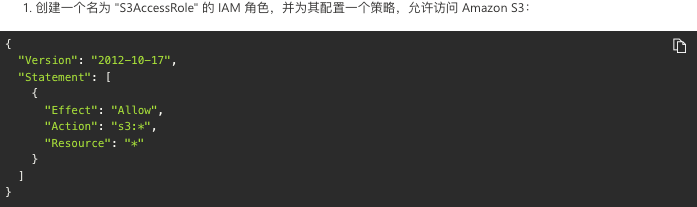
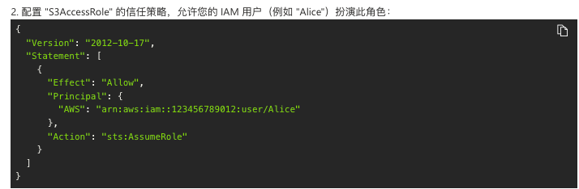
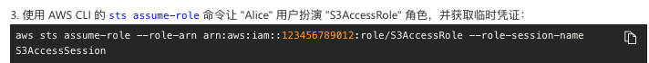
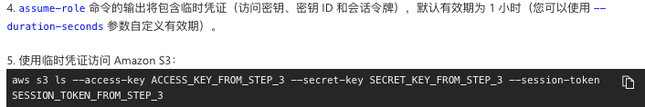
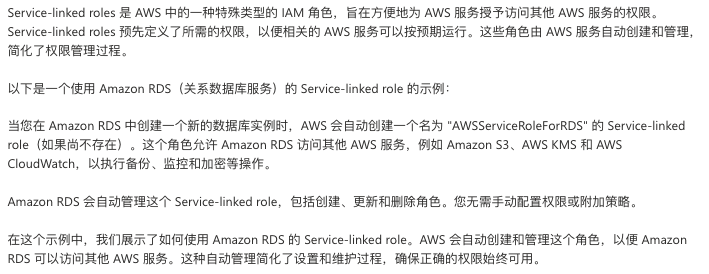
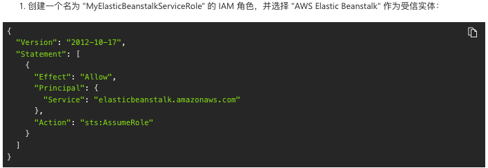
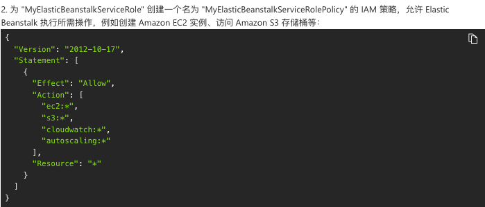
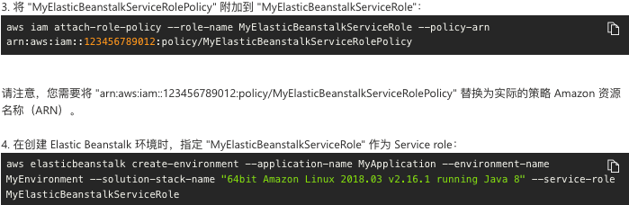

# identity and management
which principal can perform actions on what resources under what conditions
https://docs.aws.amazon.com/service-authorization/latest/reference/reference_policies_actions-resources-contextkeys.html

# iam auth && authorize
https://docs.aws.amazon.com/vpc/latest/userguide/security-iam.html#security_iam_authentication

# iam roles
https://docs.aws.amazon.com/vpc/latest/userguide/security_iam_service-with-iam.html#security_iam_service-with-iam-roles
* Use temporary credentials

* Service-linked roles

* Service roles

