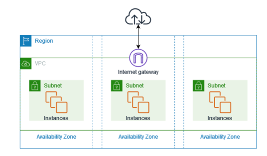
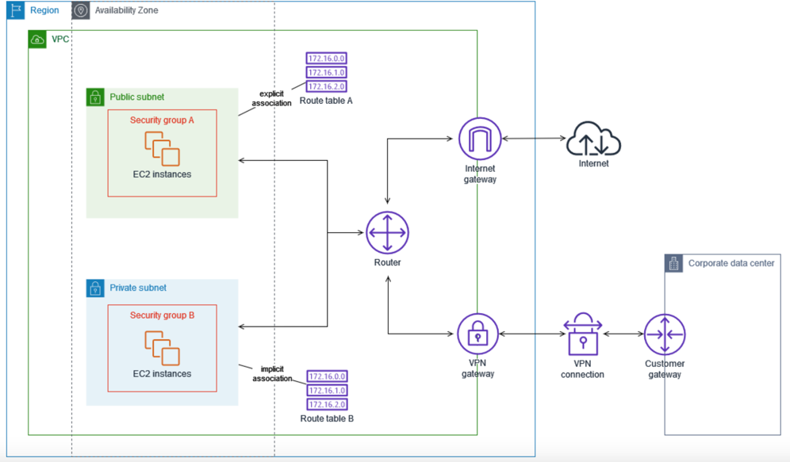
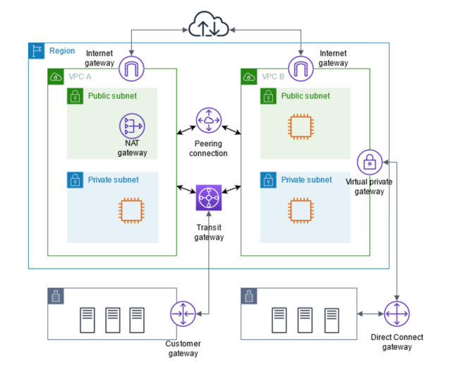
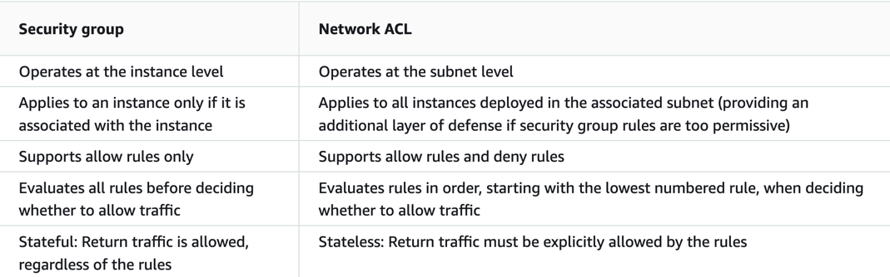

# vpc

https://docs.aws.amazon.com/vpc/latest/userguide/what-is-amazon-vpc.html

# route table

A route table contains a set of rules, called routes, that determine where network traffic from your subnet or gateway is directed.

# vpc connection

The following diagram demonstrates some of these connectivity options. VPC A is connected to the internet through an internet gateway. The EC2 instance in the private subnet of VPC A can connect to the internet using the NAT gateway in the public subnet of VPC A. VPC B is connected to the internet through an internet gateway. The EC2 instance in the public subnet of VPC B can connect to the internet using the internet gateway. VPC A and VPC B are connected to each other through a VPC peering connection and a transit gateway. The transit gateway has a VPN attachment to a data center. VPC B has a AWS Direct Connect connection to a data center.
https://docs.aws.amazon.com/vpc/latest/userguide/extend-intro.html

## push vpc flow logs to cloudwatch
https://docs.aws.amazon.com/vpc/latest/userguide/flow-logs-cwl.html

# security
https://docs.aws.amazon.com/vpc/latest/userguide/VPC_Security.html
* security group
  * apply to ec2/elb/... in vpc to control in/out bound traffic
* acl
  * apply to subnet to control in/out bound traffic
* flow logs
  * s3
  * cloudwatch
  * kdf
* traffic mirroring
* iam

# security group vs acl

