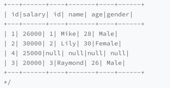

# dataframe join

## join types

example

* inner
  * 
* leftouter
  * 
* rightouter
  * 
* fullouter
  * 
* leftsemi
  * 
* leftanti
  * 

## join mechanism

* nlj nested loop join
左表，驱动表，右表，基表， 2层for循环进行匹配

O(mxn)
* smj sort merge join
先排序，后归并

O(m+n)
* hj hash join
build + probe

