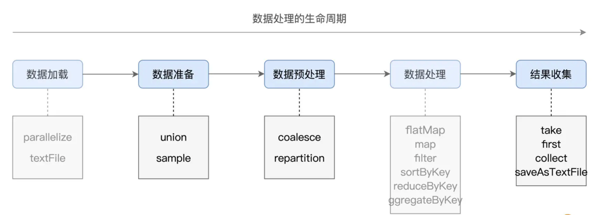
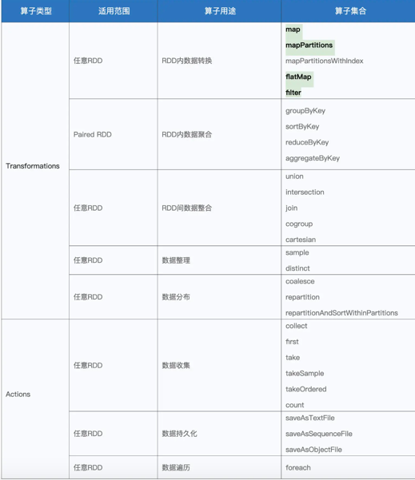
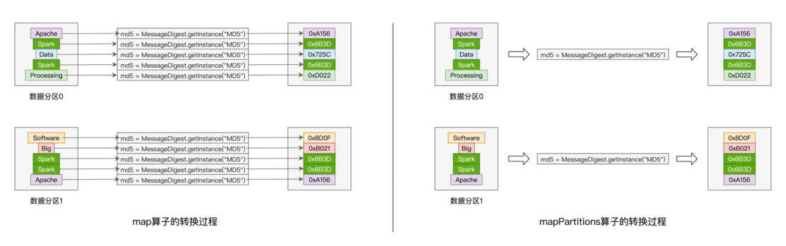
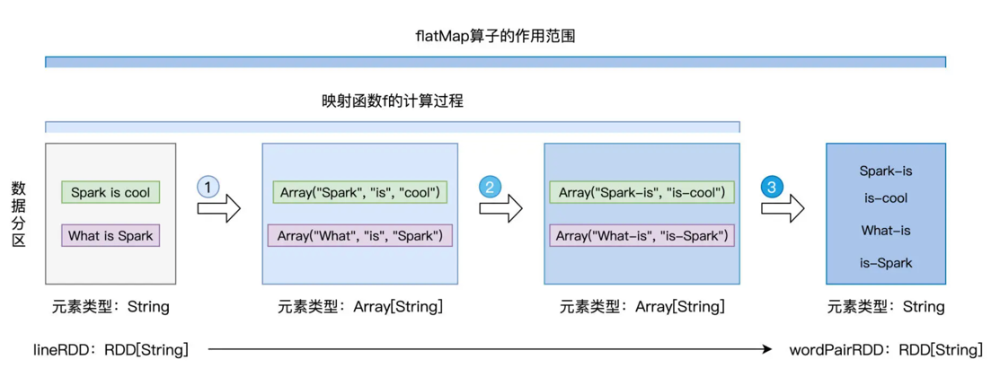
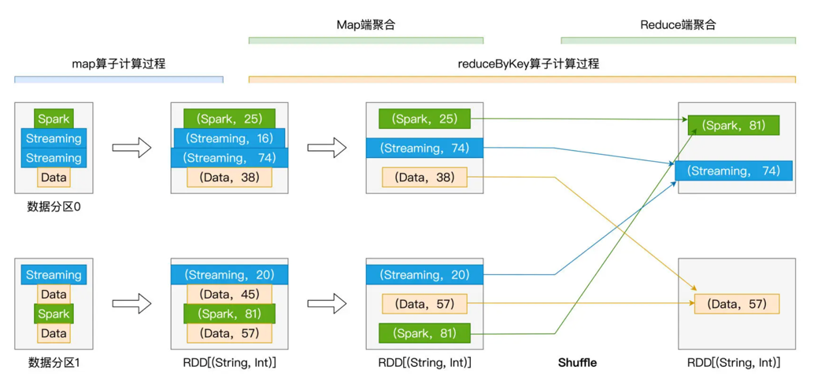
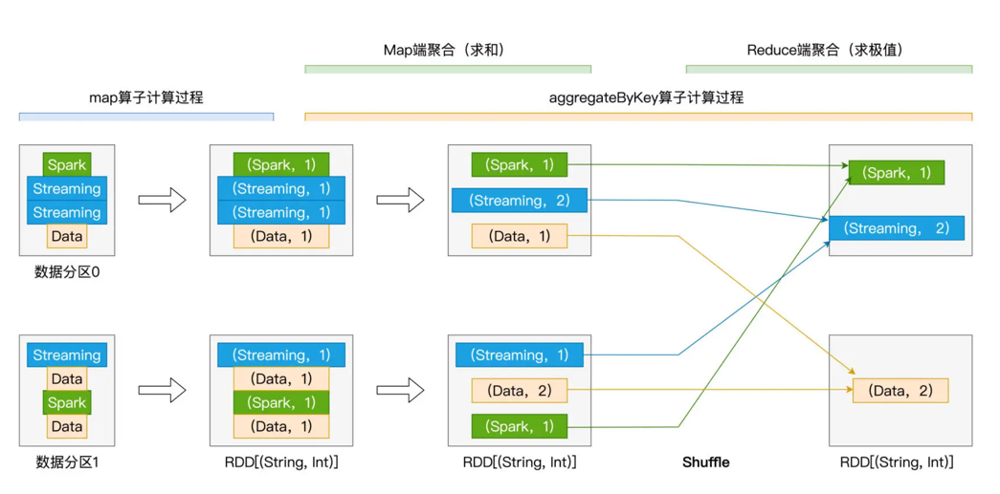
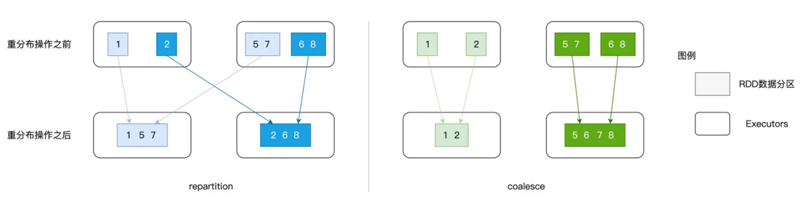
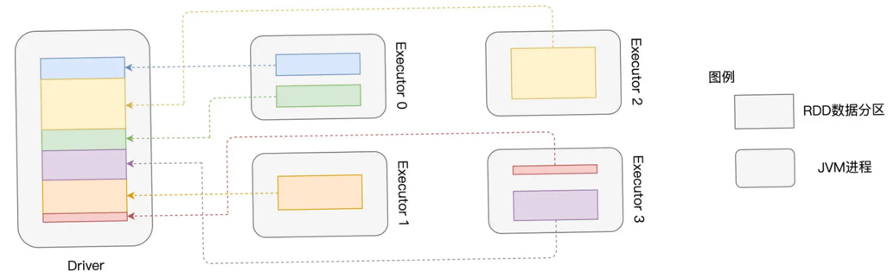
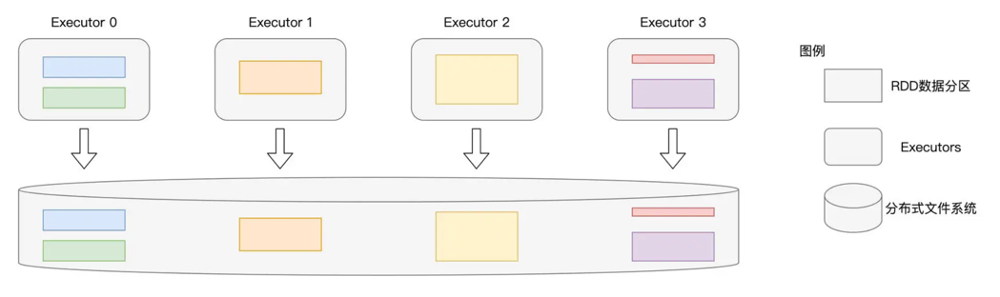

# 算子
## 算子生命周期


## 常用算子


* 99% 的数据转换场景
  * map、mapPartitions
    * 
  * flatMap
    * 
  * filter
* shuffle操作算子，典型的计算类型分别是分组、聚合和排序，必须作用在pairedRDD上(key, value)
  * groupByKey
    ```scala
    import org.apache.spark.rdd.RDD
    val cleanWordRDD: RDD[String] = _ 
    val kvRDD: RDD[(String, String)] = cleanWordRDD.map(word => (word, word))
    val words: RDD[(String, Iterable[String])] = kvRDD.groupByKey()
    ```
    * 
  * reduceByKey
    ```scala
    val kvRDD: RDD[(String, Int)] = cleanWordRDD.map(word => (word, 1))
    val wordCounts: RDD[(String, Int)] = kvRDD.reduceByKey((x: Int, y: Int) => x + y)
    ```
    
  * aggregateByKey
    ```scala
    val kvRDD: RDD[(String, Int)] = cleanWordRDD.map(word => (word, 1))
    def f1(x: Int, y: Int): Int = {
        return x + y
    }
    def f2(x: Int, y: Int): Int = {
        return math.max(x, y)
    }
    val wordCounts: RDD[(String, Int)] = kvRDD.aggregateByKey(0) (f1, f2)
    ```
    
  * sortByKey
* 其他常用
  * sample
    * 数据探索
  * union
    * 不同来源rdd合并，必须有一致的RDD[type]
  * rdd 并行度（(2~3)*cpucore*executor）
  * 
    * repartition
      * 引入shuffle
      * 跨executor
    * coalesce
      * 不引入shuffle, 降低并行度
      * executor内部
  * first/take/collect(driver)
    * 
  * saveAsTextFile
    * 

