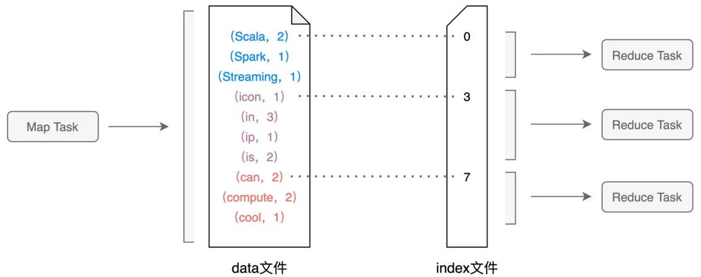

# Shuffle Internals

## shuffle 中间文件

* data (key, value)
* index (record (k,v) pairs belongs to Task)

## shuffle hashfunction
P = Hash(Record Key) % N, N is Reduce Task Number

## shuffle write

Map Task内存中有一个Map结构
Map<Key, Value>
Key (Reduce Task PartitionID, Record Key)
Value Record的value

Map读取分区内容，向Map插入内容，Map溢出， 产生Data.tmp文件
产生了若干Data.tmp文件，data.tmp1, ..., data.tmpN
shuffle write的过程是把磁盘上存有若干个溢出的临时文件，而内存的 Map 结构中留有部分数据，Spark 使用归并排序算法对所有临时文件和 Map 结构剩余数据做合并，分别生成 data 文件、和与之对应的 index 文件

## shuffle read

对于所有 Map Task 生成的中间文件，Reduce Task 需要通过网络从不同节点的硬盘中下载并拉取属于自己的数据内容