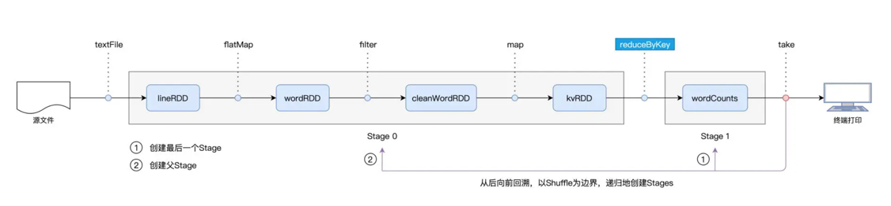

# spark scheduler component
## tow process
  * driver
    * DAGScheduler
      * Stages
        * TaskSet
    * SchedulerBackend
      * 获取集群资源WorkOffer
      * 分发Task到Executors
    * TaskScheduler
      * Task
        * 按照优先级进行Task调度
  * executor
    * ExecutorBackend
      * 并发执行Task

## Process Relation
develop create DAG-->>submit-->>
Driver-->>**DAGScheduler**-submit-TaskSet->>**TaskScheduler**-Create PriorityQueue->ScheduleByWorkOffer<<-WorkOffer-**SchedulerBackend**

## DAGScheduler
以Action算子作为起点，从后向前回溯DAG，以Shuffle算子作为边界划分Stages，创建taskSet,交给taskScheduler调度

DAGScheduler 最先提请执行的是 Stage1。在提交的时候，DAGScheduler 发现 Stage1 依赖的父 Stage，也就是 Stage0，还没有执行过，那么这个时候它会把 Stage1 的提交动作压栈，转而去提请执行 Stage0。当 Stage0 执行完毕的时候，DAGScheduler 通过出栈的动作，再次提请执行 Stage 1。

## Task
TaskSet中Task数量和RDD partition数量一致

简单来讲，task描述在哪里为谁执行什么任务
* stageId/stageAttemptId
* taskBinary 用户执行stage代码
* partition RDD分区
* locs 任务倾向节点、executeId

## SchedulerBackend
使用ExecuteDataMap记录每个executor的资源

SchedulerBackend定期和每个Executor上的ExecutorBackend通信，获取ExecutorData

## TaskScheduler
根据WorkerOffer，调度适合TaskSet中适合的Tasks
举个例子，Task 与 RDD 的 partitions 是一一对应的，在创建 Task 的过程中，DAGScheduler 会根据数据分区的物理地址，来为 Task 设置 locs 属性。locs 属性记录了数据分区所在的计算节点、甚至是 Executor 进程 ID。
当 TaskScheduler 需要调度 Task0 这个分布式任务的时候，根据 Task0 的 locs 属性，它就知道：“Task0 所需处理的数据分区，在节点 node0、node1、node2 上存有副本，因此，如果 WorkOffer 是来自这 3 个节点的计算资源，那对 Task0 来说就是投其所好”。

## ExecuteBackend
* Executors 线程池中一个又一个的 CPU 线程，每个线程负责处理一个 Task
* 每当 Task 处理完毕，这些线程便会通过 ExecutorBackend，向 Driver 端的 SchedulerBackend 发送 StatusUpdate 事件，告知 Task 执行状态。接下来，TaskScheduler 与 SchedulerBackend 通过接力的方式，最终把状态汇报给 DAGScheduler
* 对于同一个 TaskSet 当中的 Tasks 来说，当它们分别完成了任务调度与任务执行这两个环节时,Spark 调度系统就完成了 DAG 中某一个 Stage 的任务调度