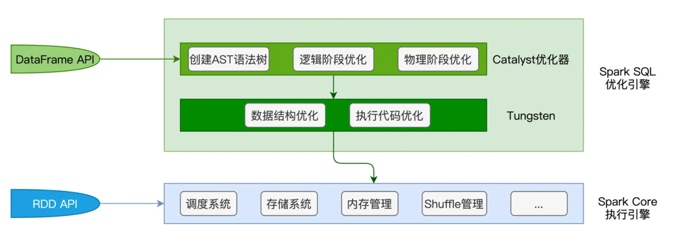

# spark SQL
spark SQL 是构建在spark core上的一层框架， spark SQL负责优化代码，spark core负责执行代码

* Dataframe
  * 带schema的二维表
  * 引擎spark SQL
  * 带分区
* RDD
  * 引擎spark core

## catalyst优化器
创建，优化执行计划
* 创建AST
* 逻辑优化
* 物理优化

## Tungsten
负责数据结构和执行代码优化
* unsafe row
  * byte array, 使用紧凑的结构来表达df
* WSCG
  * 全阶段代码生成器，捏合同一个stage的不同算子到一个function来处理每一条数据

