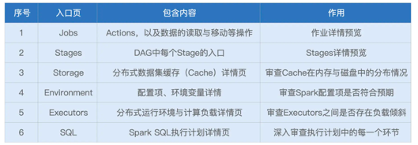
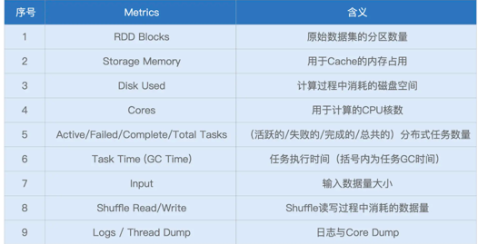
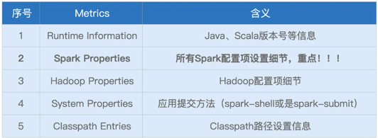
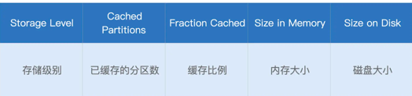
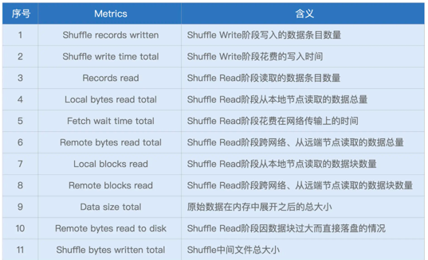
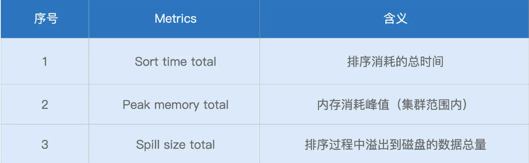
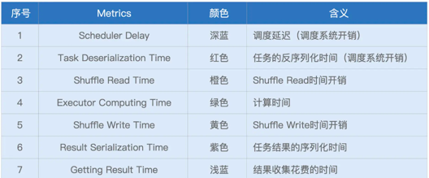
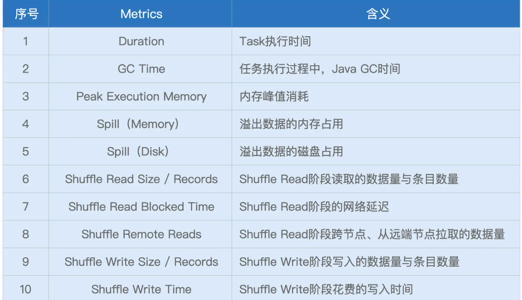

# spark ui

## 一级入口

* executors
  * 
* environments
  * 
* storage
  * 

## 二级入口
* sql
  * exchange
    * 
  * sort
    * 
  * aggregate
* jobs
  * stages
    * stage dag
    * event timeline
      * 
    * task metrics
      * 