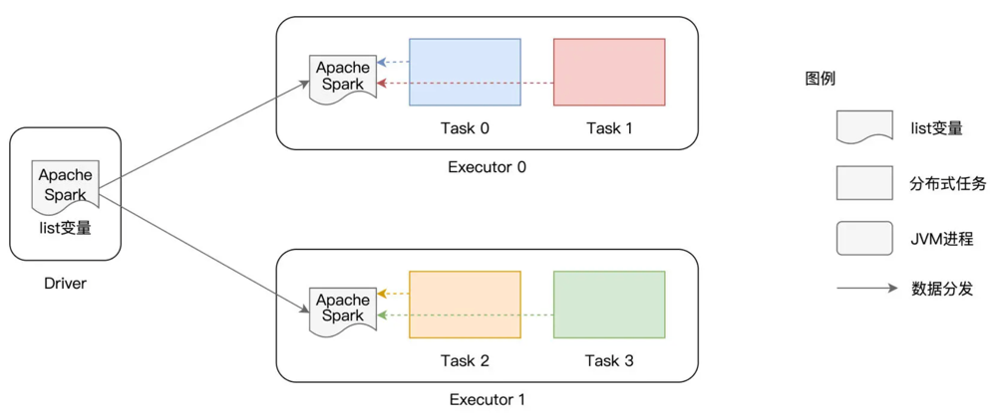

# 变量共享
* 广播变量
  ```scala
  val list: List[String] = List("Apache", "Spark")
  val bc = sc.broadcast(list)
  // 读取广播变量内容
  bc.value
  // List[String] = List(Apache, Spark)
  ```
    * 大型数据集合需要贡献，广播变量在executor级别而不是task基本进行分发
    * 
* 累加器
  * 全局计数